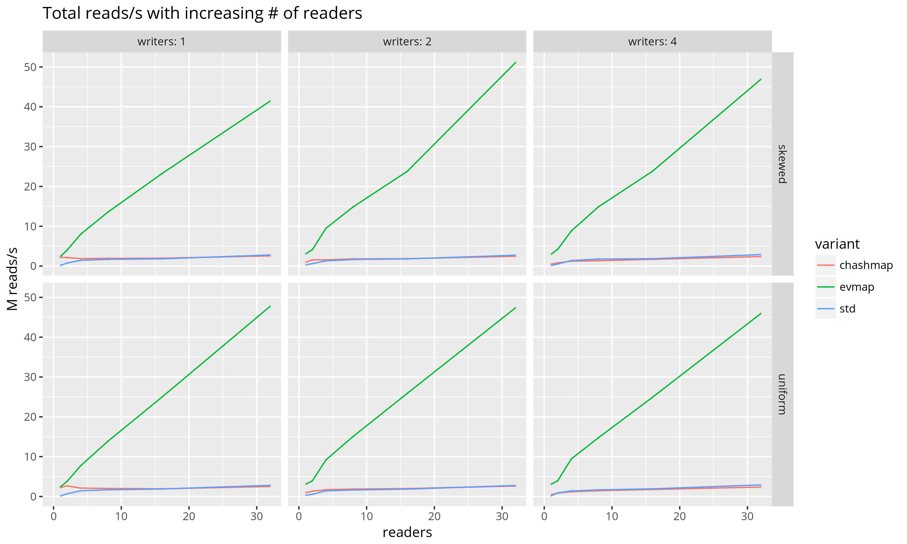
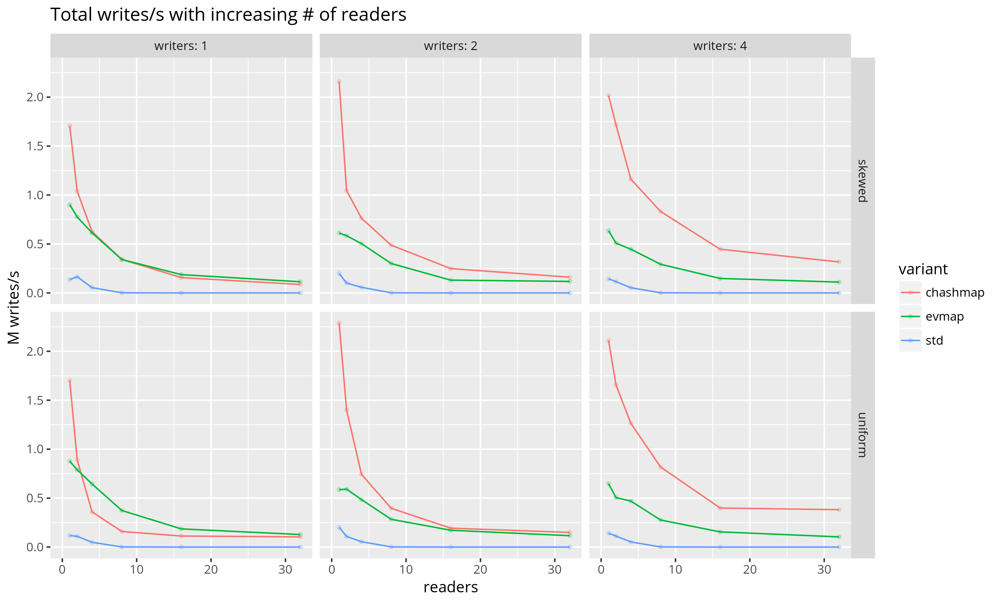

# evmap

[](https://crates.io/crates/evmap)
[](https://docs.rs/evmap/)
[](https://travis-ci.org/jonhoo/rust-evmap)

A lock-free, eventually consistent, concurrent multi-value map.

This map implementation allows readers and writers to execute entirely in parallel, with no
implicit synchronization overhead. Neither readers nor writers need not take locks on their
critical path, which significantly improves performance under contention.

The trade-off exposed by this module is one of eventual consistency: writes are not visible to
readers except following explicit synchronization. Specifically, readers only see the
operations that preceeded the last call to `WriteHandle::refresh` by a writer. This lets
writers decide how stale they are willing to let reads get. They can refresh the map after
every write to emulate a regular concurrent HashMap, or they can refresh only occasionally to
reduce the synchronization overhead at the cost of stale reads.

For read-heavy workloads, the scheme used by this module is particularly useful. Writers can
afford to refresh after every write, which provides up-to-date reads, and readers remain fast
as they do not need to ever take locks.

Under the hood, the map is implemented using two regular `HashMap`s, an operational log,
reference counting, and some pointer magic. There is a single pointer through which all readers
go. It points to an `Arc<HashMap>`, which the readers take in order to read data. When a write
happens, the writer updates the other `HashMap` (for which there are no readers), and also
stores a copy of the change in a log (hence the need for `Clone` on the keys and values). When
`WriteHandle::refresh` is called, the writer wraps its `HashMap` in a new `Arc`, and then
atomically swaps the reader pointer to point to it. The writer then waits for the reference
count of the old map to return to one (its own reference), and replays the operational log to
bring the stale map up to date.

The map is multi-value, meaning that every key maps to a *collection* of values. This
introduces some memory cost by adding a layer of indirection through a `Vec` for each value,
but enables more advanced use. This choice was made as it would not be possible to emulate such
functionality on top of the semantics of this map (think about it -- what would the operational
log contain?).

Since the implementation uses regular `HashMap`s under the hood, table resizing is fully
supported. It does, however, also mean that the memory usage of this implementation is
approximately twice of that of a regular `HashMap`, and more if writes rarely refresh after
writing.

To faciliate more advanced use-cases, each of the two maps also carry some customizeable
meta-information. The writers may update this at will, and when a refresh happens, the current
meta will also be made visible to readers. This could be useful, for example, to indicate what
time the refresh happened.

## Examples
```rust
// new will use the default HashMap hasher, and a meta of ()
// note that we get separate read and write handles
// the read handle can be cloned to have more readers
let (book_reviews_r, mut book_reviews_w) = evmap::new();

// review some books.
book_reviews_w.insert("Adventures of Huckleberry Finn",    "My favorite book.");
book_reviews_w.insert("Grimms' Fairy Tales",               "Masterpiece.");
book_reviews_w.insert("Pride and Prejudice",               "Very enjoyable.");
book_reviews_w.insert("The Adventures of Sherlock Holmes", "Eye lyked it alot.");

// at this point, reads from book_reviews_r will not see any of the reviews!
assert_eq!(book_reviews_r.len(), 0);
// we need to refresh first to make the writes visible
book_reviews_w.refresh();
assert_eq!(book_reviews_r.len(), 4);
// reads will now return Some() because the map has been initialized
assert_eq!(book_reviews_r.get_and("Grimms' Fairy Tales", |rs| rs.len()), Some(1));

// remember, this is a multi-value map, so we can have many reviews
book_reviews_w.insert("Grimms' Fairy Tales",               "Eh, the title seemed weird.");
book_reviews_w.insert("Pride and Prejudice",               "Too many words.");

// but again, new writes are not yet visible
assert_eq!(book_reviews_r.get_and("Grimms' Fairy Tales", |rs| rs.len()), Some(1));

// we need to refresh first
book_reviews_w.refresh();
assert_eq!(book_reviews_r.get_and("Grimms' Fairy Tales", |rs| rs.len()), Some(2));

// oops, this review has a lot of spelling mistakes, let's delete it.
// empty deletes *all* reviews (though in this case, just one)
book_reviews_w.empty("The Adventures of Sherlock Holmes");
// but again, it's not visible to readers until we refresh
assert_eq!(book_reviews_r.get_and("The Adventures of Sherlock Holmes", |rs| rs.len()), Some(1));
book_reviews_w.refresh();
assert_eq!(book_reviews_r.get_and("The Adventures of Sherlock Holmes", |rs| rs.len()), None);

// look up the values associated with some keys.
let to_find = ["Pride and Prejudice", "Alice's Adventure in Wonderland"];
for book in &to_find {
    let reviewed = book_reviews_r.get_and(book, |reviews| {
        for review in reviews {
            println!("{}: {}", book, review);
        }
    });
    if reviewed.is_none() {
        println!("{} is unreviewed.", book);
    }
}

// iterate over everything.
book_reviews_r.for_each(|book, reviews| {
    for review in reviews {
        println!("{}: \"{}\"", book, review);
    }
});
```

## Performance

I've run some benchmarks of evmap against a standard Rust `HashMap` protected
by a [reader-writer
lock](https://doc.rust-lang.org/std/sync/struct.RwLock.html), as well as
against [chashmap](https://crates.io/crates/chashmap) — a crate which provides
"concurrent hash maps, based on bucket-level multi-reader locks". The
benchmarks were run using the binary in [benchmark/](benchmark/src/main.rs) on
a [48-core machine](https://github.com/mit-pdos/wiki/blob/master/hosts/tom.csail.mit.edu.md#hardware-specifications).

The benchmark runs a number of reader and writer threads in tight loops, each
of which does a read or write to a random key in the map respectively. Results
for both uniform and skewed distributions are provided below. The benchmark
measures the average number of reads and writes per second as the number of
readers and writers increases.

Preliminary results show that `evmap` performs well under contention,
especially on the read side. This benchmark represents the worst-case usage of
`evmap` in which every write also does a `refresh`. If the map was refreshed
less often, performance would increase.



